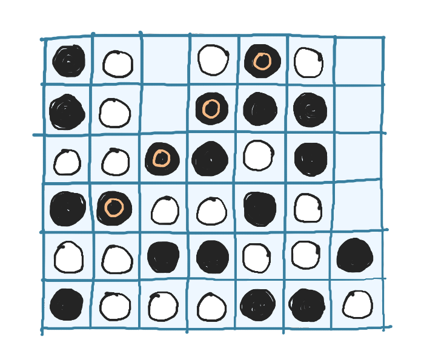
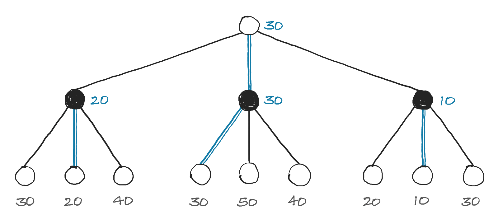
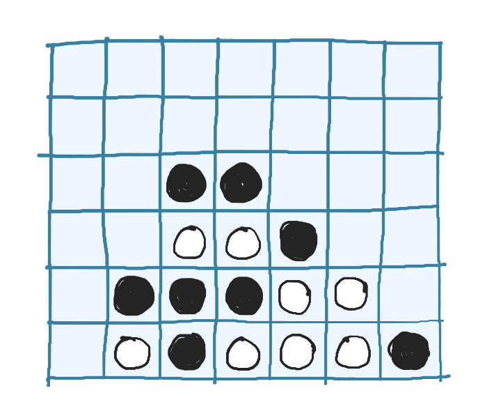
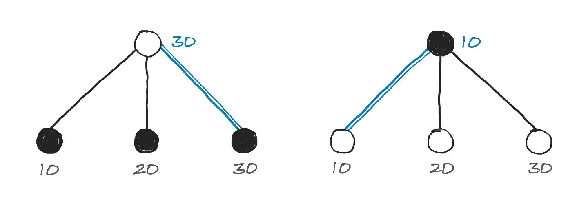
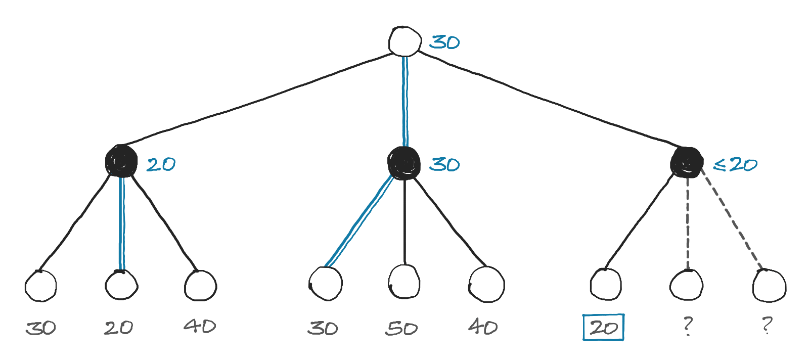
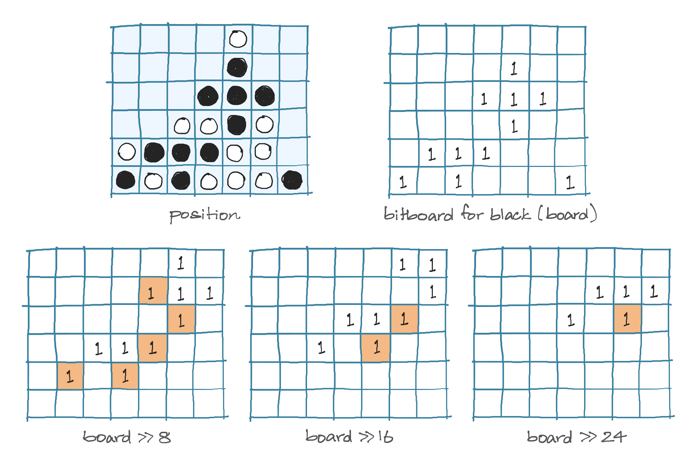

+++
title = "Exploring Board Game AI Algorithms: Minimax"
date = 2024-06-15
+++

Computers are *very* good at playing board games. Traditionally for games like Chess, algorithms like Minimax and Alpha-Beta Pruning were used to search for moves. More recently, techniques like Monte-Carlo Tree Search and Reinforcement Learning have made these AIs more formidable. 

To learn more about these algorithms, I decided to implement them from scratch. These algorithms can be applied to most board games. I chose Connect Four because it is simpler than a game like Chess or Go, but not as trivial as Tic-Tac-Toe. 

For those unfamiliar, Connect Four is played on a 6x7 board where two players, White and Black (Red and Yellow are used in the original game), take turns dropping their coins into one of the columns. The first player to line up 4 of their coins wins.

<p>
    
    <em>A Connect Four game. Black wins with a diagonal 4-in-a-row</em>
</p>

## Making a Playable Game
My approach when writing code is to write the simple solution first, *then* spend time making it better. This stops me from over-generalizing the solution early on, and provides the necessary context for optimizations later. For Connect Four, we only need three things to make a playable game:

### Representing the Board
We use a 2D array to represent the board. We set a cell to a player's value to indicate that the player's coin is in that cell. A value of `0` indicates an empty cell.
```py
nrows = 6
ncols = 7

# value representing each player
white = 1
black = 2

# there are 6*7 = 42 cells
board = [
    [0, 0, 0, 0, 0, 0, 0],
    [0, 0, 0, 0, 0, 0, 0],
    [0, 0, 0, 0, 0, 0, 0],
    [0, 0, 0, 0, 0, 0, 0],
    [0, 0, 0, 0, 0, 0, 0],
    [0, 0, 0, 0, 0, 0, 0],
]
```

### Making a Move
We place the player's coin at the bottom-most empty cell in the column.

```py
def make_move(board, player, icol):
    for irow in range(nrows - 1, -1, -1):
        if board[irow][icol] == 0:
            board[irow][icol] = player
            return True
    
    return False
```

### Checking Wins
There are 69 ways to get a 4-in-a-row — 24 ways horizontally, 21 vertically and 24 along the two diagonals. Here's the code to check the positive diagonal:
```py
for irow in range(nrows - 3):
    for icol in range(3, ncols):
        if (board[irow][icol] != 0) and (board[irow][icol] == board[irow + 1][icol - 1] == board[irow + 2][icol - 2] == board[irow + 3][icol - 3]):
            return board[irow][icol]
```

Checking the other directions is just as easy.

With that, and a bit of code to handle player turns, we're done! We could stop here and we'd have a basic two-player game. 

## Creating our AI Opponent
Suppose you are now playing against an AI. You start by placing a coin in the middle column. The AI could respond by placing its coin in any one of the seven columns. How does it figure out which of those columns is the best one?

### Minimax and Negamax
Consider a simplified search tree as shown, where there are only three possible responses to a move, and we search 2 moves deep. Each node represents a position that could result form a move. The numbers at the bottom represent scores for a position, where a higher score is more favourable for White, and a lower score is more favourable for Black. The blue lines represent the best move for a node.


*Minimax search tree*

 A White node picks the path that leads to the highest score, while a Black node picks the path that leads to the lowest score. This way, a player can pick the best move out of all possibilities. This idea forms the basis for the **minimax** algorithm.

But how do we find the scores? Ideally, instead of just looking 2 moves deep, the AI should look through *all* possible moves until the end of the game. Depending on who wins in a position, we could assign a score (+100 for a win by White, 0 for a tie, -100 for a win by Black). But this is impractical.

Since there are 7 possible responses to any move (assuming none of the columns are filled), if the AI looks 1 move deep, that's 7 positions to consider. At 2 moves deep, that's 7<sup>2</sup> = 49 positions. At 10 moves deep, that number grows to about a quarter of a Billion. A Connect Four game can have upto 42 moves, and it turns out that there are about 4.5 Trillion unique [positions](https://oeis.org/A212693)! That's too much to search through.

But there's another way. Consider the position shown below, where most of White's coins are blocked but Black has several open spots. Black has a clear advantage.

<p>
    
    <em>Position with an advantage for Black</em>
</p>

If we could convert this information into a score, we could limit the search depth to, say 5 moves deep, which comes out to around 16,000 positions. At the end of the search, if we haven't reached an end state (win/tie), we could use this score instead. 

This is done in board games using a **heuristic** function, that takes in a board position and outputs a score. 

Creating an accurate (and fast) heuristic is hard. I spent an ungodly amount of time trying to come up with one, and when that failed, I looked to others for inspiration: 
- [Adam Pearce](https://roadtolarissa.com/connect-4-ai-how-it-works/) generates a score based on the number of open cells that can lead to a 4-in-a-row.
- [Tobias Leemann](https://tleemann.de/four.html) uses a pre-trained neural network as an evaluator.
- [Pascal Pons](https://connect4.gamesolver.org/) does not use a heuristic, since the AI computes the exact outcome of a position, made possible through tons of clever optimizations.

I ended up using a different approach that I found [here](https://file.scirp.org/Html/1-9601415_90972.htm). It might not be as effective as other heuristics, but it's so simple that it's crazy it even works as well as it does. 

Here's how it works. We assign a value to each cell in the board, based on the number of 4-in-a-rows possible from that cell. For example, from the bottom-left cell, you can get 4-in-a-row in three ways, so its value is 3.
```py
scoremap = [
    [3, 4,  5,  7,  5, 4, 3],
    [4, 6,  8,  9,  8, 6, 4],
    [5, 8, 11, 13, 11, 8, 5],
    [5, 8, 11, 13, 11, 8, 5],
    [4, 6,  8,  9,  8, 6, 4],
    [3, 4,  5,  7,  5, 4, 3]
]
```
White's score is the sum of cell values for all cells containing a White coin. Black's score is obtained in a similar way. The overall score of the position is the difference between these two values. For the position shown earlier, White's score is `58` and Black's score is `66`, making the total score `-8`, which accurately depicts an advantage for Black.

We now have everything we need to implement minimax, but there is one small inconvenice, demonstrated in the example below.


*Searching one move ahead*

White picks `max(10, 20, 30)` and Black picks `min(10, 20, 30)`. This means we have to toggle between finding the maximum or minimum score depending on if the AI is looking at a White or Black node. 

But notice that `min(a, b) = -max(-a, -b)`. So finding `min(10, 20, 30)` is equivalent to finding `-max(-10, -20, -30)`. Toggling between the players is now as simple as flipping the signs. This idea gives us the **negamax** algorithm, a variant of minimax that is identical in every way except that it has a simpler implementation.

```py
def negamax(board, player, depth):
    if depth == 0 or end_state_reached(board):
        return evaluate(board), -1
    
    best_score = -1_000_000
    best_move  = 0
    
    sign = 1 if (player == white) else -1
    
    for icol in range(ncols):
        # skip filled columns
        if board[0][icol] != 0:
            continue
        
        make_move(board, player, icol)
        score = negamax(board, switch(player), depth - 1)[0]
        undo_move(board, player, icol)

        score *= sign
        if score > best_score:
            best_score = score
            best_move  = icol
    
    best_score *= sign
    return best_score, best_move
```

We need an `undo_move` since `make_move` modifies the board and we don't want that modification to be permanent.

With that, we have a pretty decent AI. I can just about squeeze a win at a search depth of 4, but the AI gets the better of me at greater depths (I'm not very good at this game). It's more fun to have the AIs fight each other. 

In fact, the game that was shown at the very start of this post is what happened in a Depth 6 vs Depth 7 match. Despite the slight disadvantage of going second, Black won because it was able to search to a greater depth and find stronger moves.

## Making the AI Stronger

On my Apple M1 running Python 3.10, it takes about 20 seconds for the AI to make a move at depth 8. It takes much longer at the start, and gets faster as more moves are made, since the time taken depends on how many positions the AI has to evaluate. Here's what that looks like at various depths:

| Depth |     Mean Evals    |  Mean Time *(sec)* | Evals / sec |
|-------|-------------------|----------------|--------------|
|   5   |      7,783        |     0.092      |   84,597     |
|   6   |     50,656        |     0.588      |   86,149     |
|   7   |    376,705        |     4.368      |   86,241     |
|   8   |  1,979,791        |    23.198      |   85,343     |

Mean Time at Depth 8: **23.2 sec**

There are two clear candidates for improvement: Reducing `Mean Evals` and increasing `Evals/sec`.

### Optimization #1 <br> Searching Fewer Nodes with Alpha-Beta Pruning


*Pruning two branches of the search tree*

Let's look at the minimax search tree again. As we evaluate nodes from left to right, notice what happens when we reach the highlighted node (with value 20). The Black node's value is set to 20 since that's the lowest score found so far. There are now two possibilies:
- If either of the two remaining nodes have a value less than 20, the Black node's value will be updated to this lower value.
- If the two remaining nodes have a value greater than or equal to 20, the Black node's value will remain unchanged.

In either case, without evaluating the two remaining nodes, we can be certain that the value of the Black node will be less than or equal to 20. Since that's the case, White (which wants to maximize its score) will never choose this path, since it already has a path that guarantees a score of 30. This means we can completely ignore those two child nodes. So instead of evaluating 9 nodes, we only have to evaluate 7. This seems like a minor improvement, but the benefits pile up as the search depth increases.

In simpler terms, we ignore or *prune* branches of the search tree that can only lead to a worse score, but still explore paths that could lead to a better score. This technique is called **alpha-beta pruning**.

Learning and implementing this took me quite a while, but here's the gist of how I went about it. Instead of using just one value to track the best score, we use two — `alpha`, the current player's best score and `beta`, the opponent's best score.

For example, if the current player is White, `alpha` starts at `-infinity` and can increase as we find better moves, and `beta` starts at `+infinity` and can decrease as the opponent finds better moves. When `alpha >= beta`, we've reached a situation as shown in the example and we don't need to search any further.

```py
def negamax(board, player, alpha, beta, depth):
    ...
    for icol in range(ncols):
        ...
        score = negamax(board, switch(player), beta, alpha, depth - 1)[0]
        ...

        if sign*score > sign*alpha:
            alpha = score
            best_move = icol

        if sign*alpha >= sign*beta:
            break

    return alpha, best_move
```
Comparing regular minimax to minimax with alpha-beta pruning, we see a *huge* reduction in the number of evaluations:

| Depth | Mean Evals <br> *minimax* |  Mean Evals <br> *alpha-beta* |
|-------|----------------------|--------------------------|
|   5   |               7,783  |                   1,422  |
|   6   |              50,656  |                   3,484  |
|   7   |             376,705  |                  18,597  |
|   8   |           1,979,791  |                  37,656  |

That's 50x fewer nodes at depth 8! The speed improves by almost the same factor.   
Mean Time at Depth 8: **0.51 sec**

The best part about alpha-beta pruning is that the moves found will be the exact same as regular minimax, it just does so by searching fewer nodes. 


### Optimization #2 <br> Speeding up Evaluations with Bitboards
If you'd like a thorough explanation of bitboards and how to implement them for Connect Four, check out [this excellent resource](https://www.github.com/denkspuren/BitboardC4/blob/master/BitboardDesign.md).

The basic idea is this — instead of using an array, we will use a 64-bit number to represent the game board. This data structure, called a **bitboard**, is commonly used in board games to efficiently represent the game state. The bits (numbered 0 to 63) are laid out as shown:
```
  6 13 20 27 34 41 48   55 62   
 —————————————————————          
│ 5 12 19 26 33 40 47 │ 54 61   
│ 4 11 18 25 32 39 46 │ 53 60   
│ 3 10 17 24 31 38 45 │ 52 59   
│ 2  9 16 23 30 37 44 │ 51 58   
│ 1  8 15 22 29 36 43 │ 50 57   
│ 0  7 14 21 28 35 42 │ 49 56 63
 —————————————————————          
```
A cell can have one of three states — It's either empty, has a White coin, or has a Black coin. We can represent this using two bitboards, one for each player. The entire game state can now be represented with just these values:
```py
bitboards = [
    0b0000000000000000000000000000000000000000000000000000000000000000,
    0b0000000000000000000000000000000000000000000000000000000000000000
]
counter = 0
heights = [0,  7, 14, 21, 28, 35, 42]
# bit positions for the top padding row
pad_top = [6, 13, 20, 27, 34, 41, 48]
```
We increment `counter` each time a move is made. If its value is even, the current player is White, else Black. The `heights` array stores the bit position for the next free cell in each column. Notice that if a column is full, its value in the `heights` array will match the value in the `pad_top` array.

This compact representation allows for optimizations that makes things faster. Making a move is now as easy as:
```py
def make_move(state, icol):
    # set the appropriate bit for the current player to 1
    bitboards[counter & 1] ^= (1 << heights[icol])

    counter += 1
    heights[icol] += 1
```

Checking for wins is also much more efficient. For instance, lets consider the positive diagonal. Notice from the way we've laid out the bits, that the positive diagonal cells differ by a value of `8`. For example, the bit to the top-right of bit `14` is bit `22`. So for each bit, we can look at the bits that are `8`, `16` and `24` bits away, and if they are all set to 1, we have a 4-in-a-row along the positive diagonal.



We can actually check this for every bit simultaneously, as shown above.  Highlighted in orange are the bits that are in common so far. Notice that if there is a 4-in-a-row, there will be atleast one non-zero bit at the end. The implementation is as shown: 
```py
board = bitboards[1] # bitboard for Black
if board & (board >> 8) & (board >> 16) & (board >> 24) != 0: 
    return 1 # 1 indicates a win for Black
```
We can do the same for the other directions. For example, the horizontal cells differ by a value of `7`. We can check the offsets `7`, `14` and `21` to find horizontal wins.

With these optimizations, our AI is almost twice as fast.

| Depth | Mean Time <br> *2d-array* |  Mean Time <br> *bitboard* |
|-------|---------------------------|----------------------------|
|   5   |                     0.018 |                      0.010 |
|   6   |                     0.046 |                      0.024 |
|   7   |                     0.236 |                      0.126 |
|   8   |                     0.509 |                      0.268 |

Mean Time at Depth 8: **0.27 sec**

Comparing mean times at depth 8, we have ended up almost 100x faster than our original minimax implementation! There are ways to speed up the AI even more, but I decided to stop here. 

## Web Demo
I ported the code over to C++, which ended up being about 250x faster than our fastest Python implementation! I compiled it to WebAssembly and created a user interface using HTML, CSS and JavaScript. 

<a style="display: block; padding: 0.5em 4em; background-color: #dff4ff; font-weight: 500; border-radius: 3px; text-align: center; text-decoration: none; cursor: pointer;" target="_blank" href="https://balkarjun.github.io/ConnectFourAI/">Play the Demo</a>

The source code for the C++ implementation can be found [here](https://github.com/balkarjun/ConnectFourAI/).

## What Next?
If you're interested in more optimization techniques, check out [this resource](http://blog.gamesolver.org/). It's worth noting that a lot of these optimizations work better with a good heuristic. While our simple heuristic works to some extent, it fails to provide an accurate evaluation for more complex positions. Moving beyond Connect Four, there are board games for which creating a good heuristic is nearly impossible.

In a follow-up blog post, I'll explore a completely different technique to creating the AI, one that does not require a heuristic at all. DeepMind used this technique as part of their AlphaGo AI to achieve a breakthrough result in 2016.
