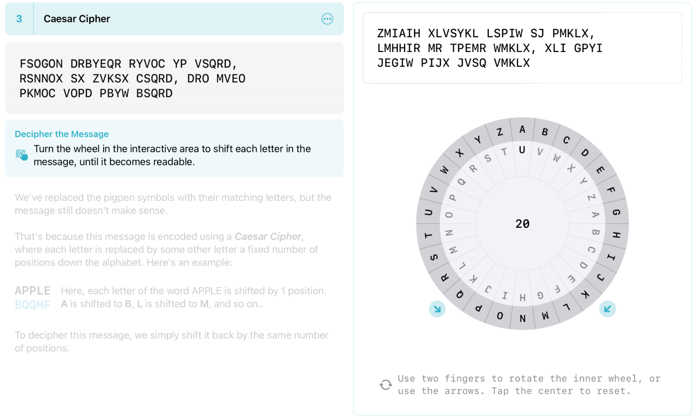

+++
title = "Ciphers"
date = 2023-05-10

[extra]
links = [
    { name = "GitHub", url = "https://github.com/balkarjun/Ciphers" }
]
+++

An educational puzzle game about cryptography, for iPadOS. Decode a cryptic message by using various cryptography techniques that were used throughout history. This app was my submission to the WWDC23 Swift Student Challenge for which I won a [scholarship](https://www.wwdcscholars.com/s/DA1B4132-19BD-4457-9B59-845BE5C03FF8/2023) from Apple.

