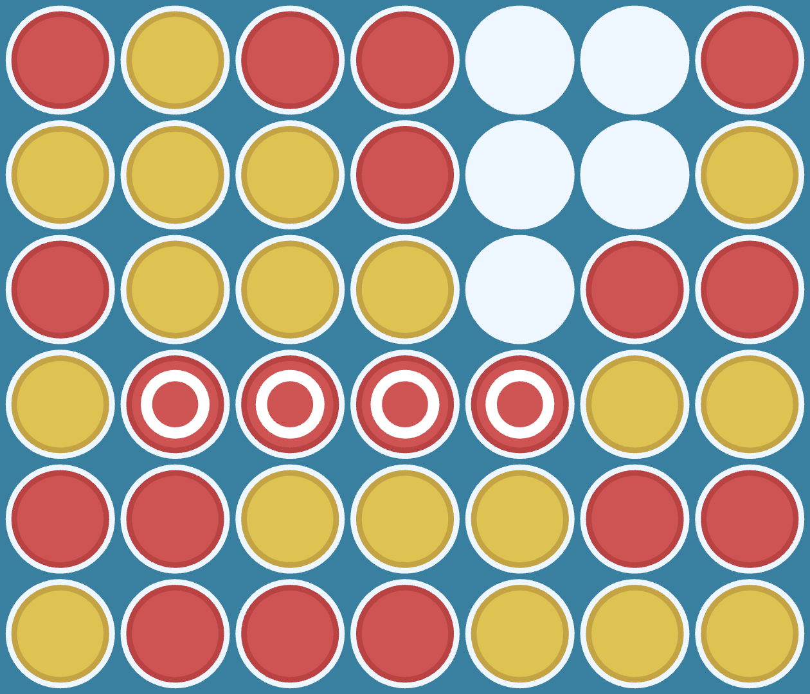

+++
title = "ConnectFourAI"
date = 2024-05-01

[extra]
links = [
    { name = "Demo", url = "https://balkarjun.github.io/ConnectFourAI/" },
    { name = "GitHub", url = "https://github.com/balkarjun/ConnectFourAI/" }
]
+++

An interactive Connect Four game with a powerful AI opponent. The AI uses a depth-limited minimax algorithm with alpha-beta pruning. 
It was written in C++ and compiled to WebAssembly resulting in a <em>blazingly fast</em> AI that can run locally on the browser. The interface was made using HTML, CSS and JavaScript.

