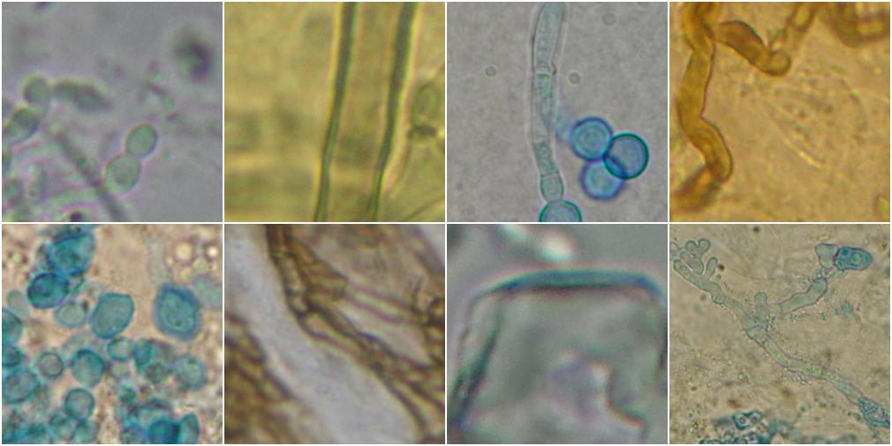

+++
title = "FungiCV"
date = 2024-06-01

[extra]
links = [
    { name = "Kaggle", url = "https://www.kaggle.com/code/balkarjun/fungi-image-classification-using-fastai-93-acc" },
    { name = "GitHub", url = "https://github.com/balkarjun/FungiCV" }
]
+++

Used the FastAI library to classify microscopic fungi images from the DeFungi dataset. This was done using transfer learning on ResNet and Vision Transformer (ViT) models. Achieved an overall accuracy of **~93%** compared to **~85%** from the original paper.

