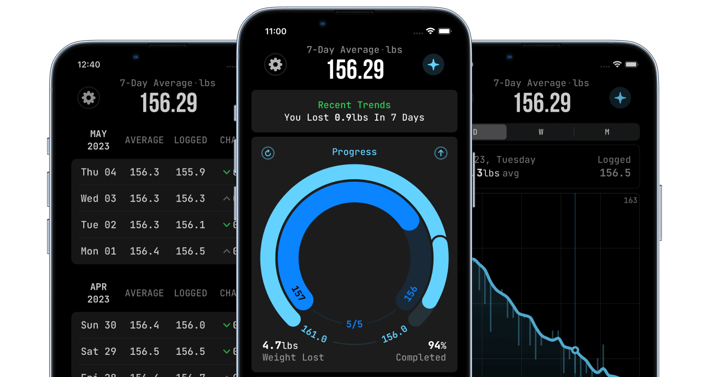

+++
title = "TapTrack"
date = 2023-06-01

[extra]
links = [
    { name = "App Store", url = "https://apps.apple.com/in/app/taptrack-weight-tracker/id1666063196" }
]
+++

Designed and developed an iOS app that uses statistical insights and data visualizations to aid users in their weight loss journey. Built using SwiftUI, Swift Charts and CoreData. Published to the AppStore on May 2023.

